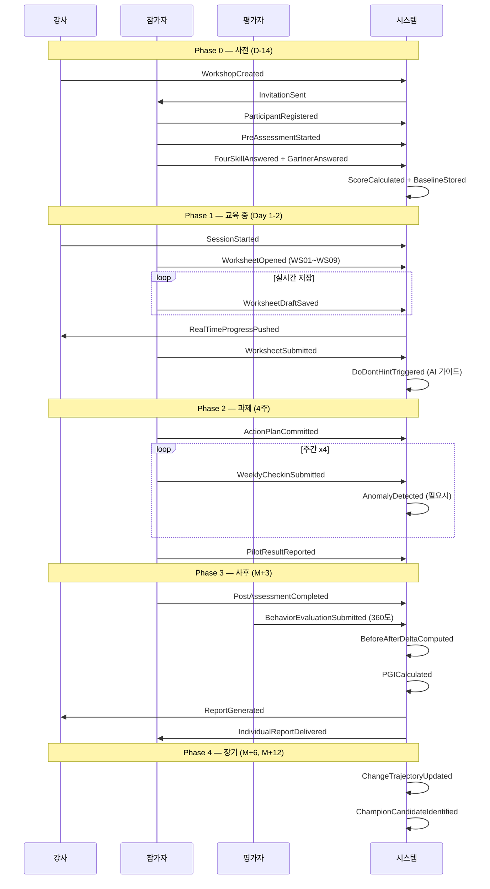
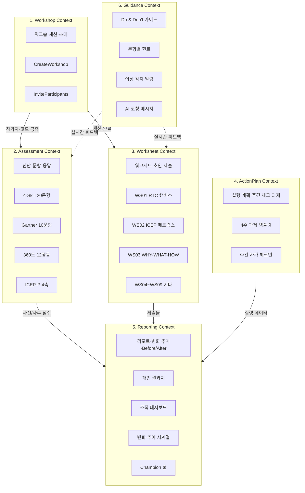
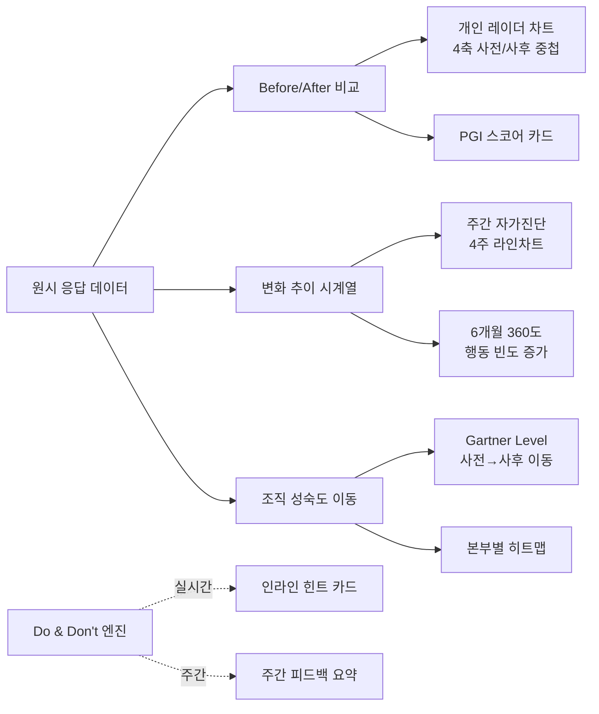

# FLOW~ AX Platform — Event Storming (Big Picture)

> **FLOW~ : AX Design Lab** | 사람과 일의 흐름을 디자인합니다
> 설계: 임정훈 (Demian) + Max (Claude Code) | 2026-04-19
> 방법론: Alberto Brandolini의 Event Storming (Big Picture → Process-level → Design-level)
> 목적: 교육·컨설팅·강의에 실제 사용할 **진단·워크시트·평가·리포팅 앱**의 도메인 이벤트 지도화

---

## 🎯 0. 목표 및 범위

### 0.1 비즈니스 목표
**"교육 종료 후 조직 변화까지 이어지는 턴키 디지털 플랫폼"**

| 차원 | 목표 | 성공 지표 |
|---|---|---|
| **효과성** | 참가자 학습 → 행동 → 조직 성과 | Kirkpatrick 4레벨 모두 측정 |
| **효율성** | 강사 1명 100명 운영 가능 | 자동 취합 + 리포트 자동 생성 |
| **체계성** | 데이터 일관성 + 변화 추적 | 사전/사후/6개월/12개월 타임라인 |

### 0.2 핵심 사용 시나리오
1. **강사**가 교육 전 워크샵을 생성하고 진단 링크를 발송
2. **참가자**가 사전 진단 (4-Skill 20문항 + Gartner 10문항) 실시
3. **참가자**가 교육 중 워크시트 WS01~WS09 작성 (실시간 저장)
4. **강사**가 대시보드에서 참가자 진행 현황 모니터링
5. **참가자**가 교육 후 과제 실행 결과 기록 (4주간)
6. **시스템**이 사전/사후 Before-After 비교 리포트 자동 생성
7. **관리자**가 조직 단위 변화 추이 대시보드 확인
8. **AI**가 Do & Don't 실시간 가이드 제공

---

## 🗺️ 1. Big Picture Event Storming

### 1.1 시간순 도메인 이벤트 (Domain Events — 오렌지 포스트잇 🟠)

```
[강사 여정]
🟠 WorkshopCreated (워크숍 생성됨)
🟠 AssessmentsConfigured (진단 도구 구성됨)
🟠 InvitationsSent (초대장 발송됨)
🟠 SessionStarted (교육 세션 시작됨)
🟠 RealTimeMonitoringEnabled (실시간 모니터링 활성화됨)
🟠 SessionEnded (교육 세션 종료됨)
🟠 PostAssessmentTriggered (사후 진단 트리거됨)
🟠 ReportGenerated (리포트 생성됨)

[참가자 여정]
🟠 ParticipantRegistered (참가자 등록됨)
🟠 PreAssessmentStarted (사전 진단 시작됨)
🟠 FourSkillAnswered (4-Skill 응답 완료)
🟠 GartnerMaturityAnswered (Gartner 진단 완료)
🟠 AssessmentCompleted (진단 완료됨)
🟠 WorksheetOpened (워크시트 열림)
🟠 WorksheetDraftSaved (워크시트 자동 저장됨)
🟠 WorksheetSubmitted (워크시트 제출됨)
🟠 ActionPlanCommitted (액션플랜 커밋됨)
🟠 WeeklyCheckinSubmitted (주간 체크인 제출됨)
🟠 PilotResultReported (파일럿 결과 보고됨)
🟠 PostAssessmentCompleted (사후 진단 완료됨)
🟠 ThreeSixtyFeedbackReceived (360도 피드백 수신됨)

[360도 평가자 여정]
🟠 EvaluatorInvited (평가자 초대됨)
🟠 BehaviorEvaluationSubmitted (행동 평가 제출됨)

[시스템 이벤트]
🟠 ScoreCalculated (점수 계산됨)
🟠 PGICalculated (개인 성장 지수 산출됨)
🟠 BeforeAfterDeltaComputed (Before/After Delta 계산됨)
🟠 ChangeTrajectoryUpdated (변화 추이 업데이트됨)
🟠 DoDontHintTriggered (Do & Don't 힌트 트리거됨)
🟠 AnomalyDetected (이상 징후 감지됨 — 응답 중단·장기 미완료)
🟠 ChampionCandidateIdentified (Champion 후보자 식별됨)
🟠 NotificationSent (알림 발송됨)
```

### 1.2 이벤트 플로우 다이어그램



---

## 🎭 2. 액터 및 커맨드 (Actors + Commands)

### 2.1 액터 (파란 포스트잇 🔵 → 노란 포스트잇 🟡)

| 액터 🔵 | 역할 | 주요 커맨드 🟡 |
|---|---|---|
| **강사 (Instructor)** | 워크숍 설계·운영·리포트 리뷰 | CreateWorkshop · ConfigureAssessment · StartSession · GenerateReport |
| **참가자 (Participant)** | 진단 응답·워크시트 작성·과제 실행 | AnswerAssessment · SaveWorksheet · SubmitWorksheet · CommitActionPlan · ReportPilotResult |
| **평가자 (Evaluator)** | 360도 피드백 제공 (상위자·동료·하위자·외부) | SubmitBehaviorEvaluation |
| **관리자 (HR/AX Admin)** | 조직 단위 집계·분석·인사 연동 | ViewOrgDashboard · ExportReports · ReviewChampions |
| **시스템 (System)** | 자동 계산·알림·이상 감지 | CalculateScore · ComputeDelta · DetectAnomaly · TriggerReminder |

### 2.2 주요 커맨드 → 이벤트 매핑

```
🟡 CreateWorkshop         → 🟠 WorkshopCreated
🟡 AnswerAssessment       → 🟠 FourSkillAnswered + 🟠 GartnerMaturityAnswered + 🟠 AssessmentCompleted
🟡 SaveWorksheet (auto)   → 🟠 WorksheetDraftSaved (10초마다)
🟡 SubmitWorksheet        → 🟠 WorksheetSubmitted + 🟠 DoDontHintTriggered
🟡 CommitActionPlan       → 🟠 ActionPlanCommitted + 🟠 NotificationSent (주간 리마인더 예약)
🟡 SubmitBehaviorEval     → 🟠 BehaviorEvaluationSubmitted (360도)
🟡 GenerateReport         → 🟠 BeforeAfterDeltaComputed + 🟠 PGICalculated + 🟠 ReportGenerated
```

---

## 🗂️ 3. Bounded Contexts (경계 컨텍스트)

각 Context는 독립된 책임·데이터·규칙을 가진다.



### 3.1 각 Context의 책임

| Context | 책임 | 주요 Aggregate |
|---|---|---|
| **Workshop** | 워크숍 생명주기·참가자 초대·세션 상태 | Workshop · Session · Invitation |
| **Assessment** | 진단 문항 관리·응답 저장·점수 계산 | Assessment · Question · Response · Score |
| **Worksheet** | 9종 워크시트 스키마·초안 자동 저장·제출 | Worksheet · Draft · Submission |
| **ActionPlan** | 개인 실행 계획·주간 체크인·과제 상태 | ActionPlan · WeeklyCheckin · PilotResult |
| **Reporting** | Before/After Delta·PGI·조직 성숙도·변화 추이 | Report · Trajectory · Dashboard |
| **Guidance** | 문항별 Do&Don't 규칙·AI 코칭·이상 감지 | Hint · Rule · AnomalyDetector |

---

## ⚠️ 4. Policy & Hot Spots (규칙과 쟁점)

### 4.1 정책 (라일락 포스트잇 🟣)
| Policy | 내용 |
|---|---|
| **🟣 사전 진단 미완료 정책** | 교육 3일 전까지 미완료 시 자동 리마인더 3회 |
| **🟣 워크시트 자동 저장 정책** | 10초 간격 Draft 자동 저장, 제출 시 immutable 확정 |
| **🟣 4주 과제 주간 체크인 정책** | 매주 금 16:45 리마인더, 미응답 2주 시 강사 알림 |
| **🟣 이상 감지 정책** | 응답 시간 < 30초 (날림) 또는 > 2시간 (중단) 시 플래그 |
| **🟣 Champion 식별 정책** | 4-Skill PGI ≥ 40% AND 360도 ≥ 4.0 AND 전파 ≥ 1명 → 후보 |
| **🟣 Do & Don't 정책** | 리커트 1점 연속 3개 → Open Mindset Do 힌트 | 응답 모두 5점 → "성찰 필요" Don't 경고 |

### 4.2 Hot Spots (빨간 포스트잇 🔴 — 미해결 쟁점)

| Hot Spot | 질문 | 해결 방향 |
|---|---|---|
| 🔴 **익명성 vs 추적성** | 참가자 PGI를 개인별로 보여줄 것인가? | 기본 익명 코드(P01~), 본인은 자기 결과만 열람 |
| 🔴 **이상 감지 기준** | "날림 응답"을 어떻게 판별? | 응답 시간 + 분산도(모두 3점 → 날림 플래그) |
| 🔴 **360도 평가자 초대 채널** | 이메일? SMS? 카카오? | 초기 MVP는 이메일 링크, 추후 카카오 알림톡 |
| 🔴 **오프라인 사용** | 교육장 Wi-Fi 문제 시? | localStorage 폴백 → 재연결 시 자동 동기화 (기존 패턴 유지) |
| 🔴 **결과지 PDF 출력** | 누가 책임? 개인 다운로드? | MVP: html2pdf.js 클라이언트 PDF, v2: 서버 Cloud Function |
| 🔴 **인사 연동** | HRIS 연동 API는 어디까지? | MVP: CSV 내보내기, v2: SSO + API |

---

## 🔗 5. External Systems (노란 포스트잇 🟡 — 외부 시스템)

| 시스템 | 통합 방식 | 목적 |
|---|---|---|
| **Firebase Auth** | Google SSO · 익명 인증 | 강사/관리자 로그인, 참가자 익명 세션 |
| **Firestore** | 실시간 NoSQL | 모든 도메인 데이터 저장 |
| **Firebase Hosting** | 정적 호스팅 fallback | Vercel 장애 시 백업 |
| **Vercel** | 주 호스팅 + CI/CD | main 브랜치 자동 배포 |
| **GitHub** | 버전 관리 + CI/CD 트리거 | `rescuemyself/flow-ax-workshop` |
| **Chart.js** (CDN) | 대시보드 시각화 | 변화 추이·레이더·Before/After 바차트 |
| **html2pdf.js** (CDN) | 결과지 PDF 내보내기 | 참가자 PDF 다운로드 |
| **(옵션) OpenAI API** | Do & Don't AI 코칭 | 서버리스 함수로 프록시 (API 키 보호) |

---

## 📊 6. Reporting 요구사항 — 핵심 시각화



### 6.1 개인 리포트 구성
1. **헤더**: 이름·본부·진단일 (사전/사후)
2. **4-Skill 레이더**: 사전 vs 사후 중첩 (Chart.js radar)
3. **PGI 스코어**: (사후-사전) / (100-사전) × 100 → 등급 (우수/정상/보완/위험)
4. **360도 12행동**: 상위자·동료·자기·하위·외부 가중평균 (그룹 바차트)
5. **강점/보완 Top 3**: 자동 추출
6. **다음 단계 제안**: 등급 기반 조치 매핑

### 6.2 조직 대시보드 구성
1. **KPI 카드 3개**: L2 학습 · L3 행동 · L4 결과 (목표 대비 진행률)
2. **본부별 Gartner 히트맵**: 전략·인재·기술·문화·거버넌스 5영역 × 본부
3. **월별 스몰윈 누적**: 라인차트
4. **Champion 프로필 카드**: 본부별 3인+ 리스트
5. **EARS 5차원 레이더**: E·A·R·S 4축 + ARQ

---

## 🎯 7. Do & Don't 규칙 엔진 (샘플)

| 조건 | Do ✅ | Don't ❌ |
|---|---|---|
| A1~A5 (Open Mindset) 평균 ≤ 2.5 | **Do**: "팀 미팅에서 AI 실패 경험 1개를 먼저 공유해보세요. 심리적 안전감이 학습의 출발점입니다." | **Don't**: "모르는 것을 감추면 팀 전체가 공개 학습을 피합니다." |
| B1 (3단계 질문) ≤ 2.0 | **Do**: "다음 의사결정 전 Claude에게 (1)정보 탐색 → (2)시나리오 → (3)가정 도전 3단계로 질문해보세요." | **Don't**: "1회성 검색으로 AI 답변을 쓰면 편향·환각 리스크가 누적됩니다." |
| C3 (Champion 지원) ≤ 2.0 | **Do**: "Champion에게 주 1회 30분 자율 시간 + 도구 예산 10만원을 공식 배정하세요." | **Don't**: "Champion에게 '부가 업무'로 떠넘기면 3개월 내 이탈합니다 (MIT NANDA 데이터)." |
| D2 (거버넌스) ≤ 2.5 | **Do**: "WS09 거버넌스 체크리스트 4영역을 본부장에게 1페이지로 요약 보고하세요." | **Don't**: "규정이 나중에 따라오기를 기다리지 마세요 — 리스크가 먼저 현실화됩니다." |
| 모든 응답 5점 | **Do**: "동료 피드백 3명을 받아 교차 검증해보세요." | **Don't**: "자가진단 과신은 Upper Echelons Theory의 맹점을 강화합니다." |
| 주간 체크인 2주 연속 미응답 | **Do**: "15분 자가 체크인 루틴을 금요일 16:45에 달력 블록하세요." | **Don't**: "'다음 주에 몰아서'는 행동 변화를 90% 무력화합니다 (Kirkpatrick L3)." |

---

## 🧭 8. 다음 단계 → DDD 도메인 모델링

Event Storming에서 도출한 Bounded Context 6개를 기반으로:

1. **`02_DDD_Domain_Model.md`**: Aggregate·Entity·Value Object 정의
2. **`03_PRD.md`**: 화면별 기능 명세 + API + Firestore 스키마
3. **`04_UX_Flow.md`**: 참가자·강사·관리자 여정별 화면 플로우
4. **`05_Implementation_Strategy.md`**: MVP 우선순위 + 기술 스택 + 배포

---

**FLOW~ : AX Design Lab | 사람과 일의 흐름을 디자인합니다**
flowdesign.ai.kr | rescuemyself@gmail.com | 010-5261-9459
