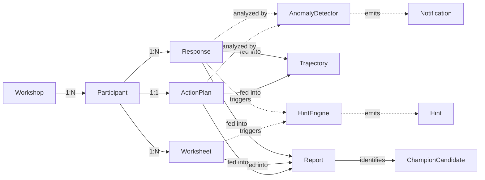

# FLOW~ AX Platform — DDD Domain Model

> **FLOW~ : AX Design Lab** | 2026-04-19
> 기반: `01_Event_Storming.md` 6개 Bounded Context
> 방법론: Eric Evans의 Domain-Driven Design (Tactical Patterns)

---

## 🧱 1. 도메인 용어집 (Ubiquitous Language)

### 1.1 핵심 개념
| 한국어 | 영문 (코드) | 정의 |
|---|---|---|
| **워크숍** | `Workshop` | 1회 교육 프로그램. 강사 1명 + 참가자 N명 + 기간 설정 |
| **참가자** | `Participant` | 워크숍에 참여하는 학습자. 익명 코드(P01~) 부여 |
| **진단** | `Assessment` | 4-Skill·Gartner·ICEP-P 문항 묶음 |
| **응답** | `Response` | 참가자가 진단 1건에 제출한 답변 세트 |
| **워크시트** | `Worksheet` | WS01~WS09 중 하나. 구조화된 작성 템플릿 |
| **초안** | `Draft` | 워크시트 작성 중인 미제출 상태 (자동 저장) |
| **제출물** | `Submission` | 워크시트 최종 제출 (immutable) |
| **액션플랜** | `ActionPlan` | 4주 과제 5항목 (ICEP 8+ 과제·목표·전파·리스크·루틴) |
| **주간 체크인** | `WeeklyCheckin` | 과제 실행 중 주간 자가 보고 |
| **리포트** | `Report` | 자동 생성된 개인·조직 결과지 |
| **변화 추이** | `Trajectory` | 시점별 점수 변화 시계열 |
| **PGI** | `PersonalGrowthIndex` | (사후-사전) / (100-사전) × 100 |
| **Delta** | `BeforeAfterDelta` | 단일 지표의 사전/사후 차이 |
| **Champion** | `ChampionCandidate` | PGI ≥ 40% + 360도 ≥ 4.0 + 전파 1명+ 조건 |
| **힌트** | `Hint` | Do & Don't 가이드 메시지 |
| **이상 징후** | `Anomaly` | 응답 패턴 이상 (날림·중단·미응답) |

---

## 🎯 2. Bounded Context 1 — Workshop

### 2.1 Aggregate: Workshop

```
Workshop (Aggregate Root)
├── id: WorkshopId (VO)
├── name: string
├── type: WorkshopType (enum: 'ax-leadership' | 'hackathon' | 'vibe-coding' | 'ax-redesign')
├── code: WorkshopCode (VO, 4-char uppercase)
├── instructorId: UserId (VO)
├── status: WorkshopStatus ('draft' | 'active' | 'completed' | 'archived')
├── assessmentConfig: AssessmentConfig (VO)
├── timeline: Timeline (VO)  -- startDate · endDate · preAssessmentDate · postAssessmentDate
├── participants: ParticipantRef[]  -- 내부 참조
├── sessions: Session[]  -- Entity 컬렉션
└── createdAt, updatedAt
```

### 2.2 Entity: Session
```
Session
├── id: SessionId (VO)
├── workshopId: WorkshopId
├── moduleId: string (M0 | M1 | M2 | M3 | M4 | M5 | followup)
├── scheduledAt: DateTime
├── status: SessionStatus ('scheduled' | 'in_progress' | 'completed')
└── attendanceRecords: AttendanceRecord[]
```

### 2.3 Value Objects
```
WorkshopCode { value: string (4 chars, uppercase, no ambiguous chars like 0/O) }
Timeline { startDate, endDate, preAssessmentDue, postAssessmentDue }
AssessmentConfig { enabledAssessments: Set<AssessmentType>, questionVersion: string }
```

### 2.4 Invariants (불변식)
- Workshop은 최소 1명의 Instructor가 필요
- code는 전역 유니크
- timeline.postAssessmentDate > timeline.endDate + 7일
- status가 'completed'인 Workshop은 재활성화 불가

### 2.5 도메인 이벤트 (Emitted)
- `WorkshopCreated` · `WorkshopActivated` · `WorkshopCompleted`
- `ParticipantJoined` · `SessionStarted` · `SessionEnded`

---

## 🎯 3. Bounded Context 2 — Assessment

### 3.1 Aggregate: Assessment

```
Assessment (Aggregate Root)
├── id: AssessmentId (VO)
├── type: AssessmentType ('4skill' | 'gartner' | '360-behavior' | 'icep')
├── version: string (문항 버전 관리)
├── questions: Question[]  -- 내부 Entity
├── scoringRule: ScoringRule (VO)
└── metadata: { title, description, language, estimatedDuration }
```

### 3.2 Entity: Question
```
Question
├── id: QuestionId (VO)
├── assessmentId: AssessmentId
├── axis: string (A | B | C | D | 전략 | 인재 | 기술 | 문화 | 거버넌스)
├── order: number
├── type: QuestionType ('likert5' | 'likert7' | 'choice5' | 'choice10' | 'open')
├── text: Localized<string>  -- 한/영 등
├── doHint: string (Do 가이드)
├── dontHint: string (Don't 가이드)
└── hintTriggers: HintTrigger[]  -- 예: "답변이 1-2일 때 힌트 표시"
```

### 3.3 Aggregate: Response

```
Response (Aggregate Root)
├── id: ResponseId (VO)
├── assessmentId: AssessmentId
├── participantId: ParticipantId
├── phase: ResponsePhase ('pre' | 'mid' | 'post' | '360-self' | '360-supervisor' | '360-peer' | '360-subordinate' | '360-external')
├── answers: Answer[]  -- 내부 VO 컬렉션
├── scoreSummary: ScoreSummary (VO)  -- 자동 계산
├── submittedAt: DateTime
├── responseDurationSec: number
├── anomalyFlags: AnomalyFlag[]
└── status: ResponseStatus ('in_progress' | 'submitted' | 'invalidated')
```

### 3.4 Value Objects
```
Answer {
  questionId: QuestionId,
  value: number | string,
  answeredAt: DateTime,
  timeSpentSec: number,
  revisions: number
}

ScoreSummary {
  byAxis: Record<axis, number>,  -- 축별 평균
  total: number,
  level: Level ('L1' | 'L2' | 'L3' | 'L4' | 'L5'),
  percentile: number (조직 대비)
}

AnomalyFlag {
  type: 'speed' | 'variance_zero' | 'incomplete' | 'revisit_late',
  detectedAt: DateTime,
  severity: 'info' | 'warn' | 'critical'
}
```

### 3.5 Invariants
- Response는 submitted 상태에서 편집 불가 (새 Response 생성 필요)
- answers.length == assessment.questions.length
- phase 'post'는 같은 participant의 phase 'pre' Response 존재 시에만 생성 가능
- timeSpentSec < 30 이면 AnomalyFlag('speed') 자동 부여

### 3.6 도메인 이벤트
- `AssessmentStarted` · `AnswerSubmitted` · `AssessmentCompleted`
- `AnomalyDetected` · `ScoreCalculated`

---

## 🎯 4. Bounded Context 3 — Worksheet

### 4.1 Aggregate: Worksheet

```
Worksheet (Aggregate Root)
├── id: WorksheetId (VO)
├── workshopId: WorkshopId
├── participantId: ParticipantId
├── template: WorksheetTemplate (enum: WS01 | WS02 | ... | WS09)
├── schema: WorksheetSchema (VO) -- 동적 필드 정의
├── draft: Draft (Entity, optional)
├── submission: Submission (Entity, optional)
└── status: WorksheetStatus ('not_started' | 'in_progress' | 'submitted')
```

### 4.2 WorksheetTemplate 9종
```
WS01: RTC 캔버스 (Role·Task·Competency)
WS02: ICEP 매트릭스 (I·C·E·P 4축, 다중 행 테이블)
WS03: WHY-WHAT-HOW 재설계 (AS-IS → TO-BE)
WS04: STAR-AR 코칭 시나리오
WS05: EARS 5차원 대시보드 (지표 설정)
WS06: 파일럿 4주 실행계획
WS07: 변화 저항 지도 (4유형 포지셔닝)
WS08: 프롬프트 라이브러리 (코레일 업무별)
WS09: 거버넌스 4영역 체크리스트
```

### 4.3 Entity: Draft
```
Draft
├── id: DraftId
├── worksheetId: WorksheetId
├── data: Record<string, any>  -- 스키마 기반 동적 필드
├── autoSavedAt: DateTime
├── version: number  -- 낙관적 잠금
└── incompleteFields: string[]  -- UI 힌트용
```

### 4.4 Entity: Submission (immutable)
```
Submission
├── id: SubmissionId
├── worksheetId: WorksheetId
├── data: Record<string, any>  -- 최종 확정값 (frozen)
├── submittedAt: DateTime
├── hash: string  -- 무결성 검증
└── reviewNotes: ReviewNote[]  -- 강사 코멘트
```

### 4.5 Invariants
- Draft는 mutable, Submission은 immutable
- Submission 생성 시 Draft는 보존 (편집 불가로 전환)
- WS02 ICEP 최소 3행 이상 입력 (제출 요건)
- WS06 성공 기준은 정량 2 + 정성 1 필수

### 4.6 도메인 이벤트
- `WorksheetOpened` · `DraftSaved` · `WorksheetSubmitted`
- `SubmissionReviewed`

---

## 🎯 5. Bounded Context 4 — ActionPlan

### 5.1 Aggregate: ActionPlan

```
ActionPlan (Aggregate Root)
├── id: ActionPlanId
├── participantId: ParticipantId
├── workshopId: WorkshopId
├── tasks: Task[]  -- 5항목 기본 + Champion 확장 2항목
├── weeklyCheckins: WeeklyCheckin[]
├── pilotResult: PilotResult (optional, 4주 후)
├── status: ActionPlanStatus ('draft' | 'committed' | 'in_progress' | 'completed')
├── committedAt: DateTime
└── completedAt: DateTime
```

### 5.2 Value Object: Task
```
Task {
  order: number (1~5 또는 6~7 Champion),
  title: string,
  type: 'icep_task' | 'quant_goal' | 'propagation' | 'risk' | 'routine' | 'propagation_cross' | 'wave2_proposal',
  payload: Record<string, any>  -- 타입별 동적 필드
}

예: type='icep_task' → payload { taskName, icepScore: {i,c,e,p,total} }
    type='quant_goal' → payload { baseline, target, unit, quantitativeCount: 2, qualitative: 1 }
```

### 5.3 Entity: WeeklyCheckin
```
WeeklyCheckin
├── id: CheckinId
├── actionPlanId: ActionPlanId
├── weekNumber: 1 | 2 | 3 | 4
├── success: string  -- 성공한 것
├── failure: string  -- 실패한 것
├── nextAction: string
├── submittedAt: DateTime
└── reminderCount: number  -- 강사 알림 트리거 계산용
```

### 5.4 Entity: PilotResult
```
PilotResult
├── id: PilotResultId
├── actionPlanId: ActionPlanId
├── baselineMetrics: Metrics (VO) -- Before
├── afterMetrics: Metrics (VO)   -- After
├── improvementRate: Record<string, number>  -- 자동 계산
├── qualitativeReview: string
├── submittedAt: DateTime
└── successCriteriaMet: boolean
```

### 5.5 Invariants
- ActionPlan commit 후 Task 변경 불가 (새 ActionPlan 생성)
- WeeklyCheckin 1~4주차 순서대로만 제출 가능
- PilotResult는 WeeklyCheckin 3회 이상 완료 시 생성 가능

---

## 🎯 6. Bounded Context 5 — Reporting

### 6.1 Aggregate: Report

```
Report (Aggregate Root)
├── id: ReportId
├── type: ReportType ('individual' | 'team' | 'org' | 'longitudinal')
├── subjectId: string  -- participantId 또는 orgId
├── period: Period (VO) -- startDate, endDate, snapshotDate
├── sections: ReportSection[]  -- Entity 컬렉션
├── generatedAt: DateTime
├── version: string  -- 재생성 추적
└── shareUrl: string (optional, 공개 링크)
```

### 6.2 Entity: ReportSection
```
ReportSection
├── id: SectionId
├── reportId: ReportId
├── type: SectionType ('radar' | 'before_after_bar' | 'trajectory_line' |
                     'pgi_card' | 'anomaly_alert' | 'champion_badge' | 'do_dont_summary')
├── title: string
├── data: Record<string, any>  -- 시각화 원본 데이터
└── chartConfig: ChartConfig (VO)
```

### 6.3 Aggregate: Trajectory (시계열)

```
Trajectory (Aggregate Root)
├── id: TrajectoryId
├── subjectId: string
├── axis: string (지표 축)
├── points: TimeSeriesPoint[]  -- VO 컬렉션
└── trend: 'improving' | 'stable' | 'declining'  -- 자동 분류
```

### 6.4 Value Object: TimeSeriesPoint
```
TimeSeriesPoint {
  timestamp: DateTime,
  value: number,
  phase: 'pre' | 'mid_w1' | 'mid_w2' | ... | 'post' | 'm6' | 'm12',
  source: AssessmentId | WeeklyCheckinId
}
```

### 6.5 Domain Service: ReportGenerator
```
ReportGenerator (Domain Service)
├── generateIndividual(participantId) → Report
├── generateOrg(workshopId) → Report
├── computeBeforeAfterDelta(preResp, postResp) → Delta
├── computePGI(preTotal, postTotal) → number
├── computeTrajectory(responses) → Trajectory
└── identifyChampions(workshopId) → ChampionCandidate[]
```

### 6.6 Domain Events
- `ReportGenerated` · `TrajectoryUpdated` · `DeltaComputed`
- `ChampionCandidateIdentified`

---

## 🎯 7. Bounded Context 6 — Guidance (Do & Don't)

### 7.1 Aggregate: HintRule

```
HintRule (Aggregate Root)
├── id: RuleId
├── name: string
├── scope: RuleScope ('question' | 'assessment_complete' | 'worksheet' | 'checkin_missed')
├── condition: Condition (VO)  -- JSON DSL
├── do: LocalizedHint
├── dont: LocalizedHint
├── priority: number
└── metadata: { source, createdBy, version }
```

### 7.2 Value Object: Condition (DSL 예시)
```json
{
  "type": "axisAverage",
  "axis": "A",
  "operator": "lessThanOrEqual",
  "value": 2.5,
  "phase": "pre"
}

{
  "type": "allAnswersEqual",
  "value": 5,
  "minQuestions": 5
}

{
  "type": "checkinMissed",
  "consecutiveWeeks": 2
}
```

### 7.3 Domain Service: HintEngine
```
HintEngine (Domain Service)
├── evaluate(responseOrDraft, rules[]) → Hint[]
├── renderHint(rule, context) → DisplayableHint
└── suppressDuplicates(hints[]) → Hint[]  -- 같은 세션 내 중복 방지
```

### 7.4 AnomalyDetector (Domain Service)
```
AnomalyDetector
├── checkResponseSpeed(response) → AnomalyFlag?
├── checkVariance(answers) → AnomalyFlag?
├── checkCompleteness(response) → AnomalyFlag?
├── checkCheckinDelay(actionPlan) → AnomalyFlag?
└── notifyInstructor(anomaly) → void  -- 알림 발송
```

---

## 🔁 8. Aggregate 간 상호작용 다이어그램



---

## 📦 9. Repository 인터페이스 (TypeScript 스타일 의사 코드)

```typescript
interface WorkshopRepository {
  findById(id: WorkshopId): Promise<Workshop | null>
  findByCode(code: WorkshopCode): Promise<Workshop | null>
  findByInstructor(instructorId: UserId, filters?: {status?: WorkshopStatus}): Promise<Workshop[]>
  save(workshop: Workshop): Promise<void>
  delete(id: WorkshopId): Promise<void>
}

interface ResponseRepository {
  findById(id: ResponseId): Promise<Response | null>
  findByParticipantAndPhase(participantId: ParticipantId, phase: ResponsePhase): Promise<Response[]>
  findByWorkshopAndPhase(workshopId: WorkshopId, phase: ResponsePhase): Promise<Response[]>
  save(response: Response): Promise<void>
}

interface WorksheetRepository {
  findByParticipant(participantId: ParticipantId): Promise<Worksheet[]>
  findByTemplate(template: WorksheetTemplate, workshopId: WorkshopId): Promise<Worksheet[]>
  saveDraft(worksheetId: WorksheetId, draft: Draft): Promise<void>  -- 빈번히 호출
  submit(worksheetId: WorksheetId, submission: Submission): Promise<void>
}

interface ReportRepository {
  findByParticipant(participantId: ParticipantId): Promise<Report[]>
  findByWorkshop(workshopId: WorkshopId, type: ReportType): Promise<Report[]>
  save(report: Report): Promise<void>
}
```

---

## 🎁 10. Application Layer — Use Cases

```typescript
// 사례 1: 참가자 진단 제출
class SubmitAssessmentUseCase {
  execute(input: {
    participantId: ParticipantId,
    assessmentId: AssessmentId,
    phase: ResponsePhase,
    answers: Answer[]
  }) {
    // 1. Domain Service: AnomalyDetector로 플래그 체크
    // 2. Response Aggregate 생성 + scoreSummary 계산
    // 3. Repository로 저장
    // 4. Domain Event 발행: AssessmentCompleted
    // 5. HintEngine으로 피드백 생성 (비동기)
  }
}

// 사례 2: 리포트 생성
class GenerateIndividualReportUseCase {
  execute(participantId: ParticipantId) {
    // 1. Pre/Post Response 조회
    // 2. ReportGenerator.generateIndividual() 호출
    // 3. Trajectory 계산
    // 4. Report 저장
    // 5. 공유 링크 발급
    // 6. Event 발행: ReportGenerated
  }
}

// 사례 3: 워크시트 자동 저장
class AutoSaveDraftUseCase {
  execute(worksheetId: WorksheetId, data: any) {
    // 1. Worksheet 로드
    // 2. Draft.version 증가 (낙관적 잠금)
    // 3. WorksheetRepository.saveDraft()
    // 4. Firestore 실패 시 localStorage 폴백 (기존 패턴 유지)
  }
}
```

---

## 🛡️ 11. 불변식·보안·공정성 규칙 총정리

### 11.1 데이터 불변식
- ✅ Response 제출 후 편집 불가 (새 Response로 재제출)
- ✅ Submission은 immutable (hash로 무결성 검증)
- ✅ ActionPlan commit 후 Task 변경 불가
- ✅ Workshop code는 전역 유니크

### 11.2 보안
- 🔒 참가자는 본인 데이터만 읽기 가능
- 🔒 강사는 자신이 만든 Workshop 데이터만 접근
- 🔒 관리자는 조직 내 집계 데이터만 (개인 식별 불가)
- 🔒 360도 평가 응답은 평가자 익명 (집계 시에만 노출)

### 11.3 공정성
- ⚖️ AnomalyFlag가 있는 Response는 리포트에서 노출 (별도 표시)
- ⚖️ 직무 Tier(1/2/3) 기반 가중치 차등 반영
- ⚖️ 환경 보정 계수 적용 (AI 도구 접근성 제한 등)

---

## 🚀 12. 다음 단계

`03_PRD.md` — 실제 Firestore 스키마·API·화면 명세로 변환

---

**FLOW~ : AX Design Lab | 사람과 일의 흐름을 디자인합니다**
