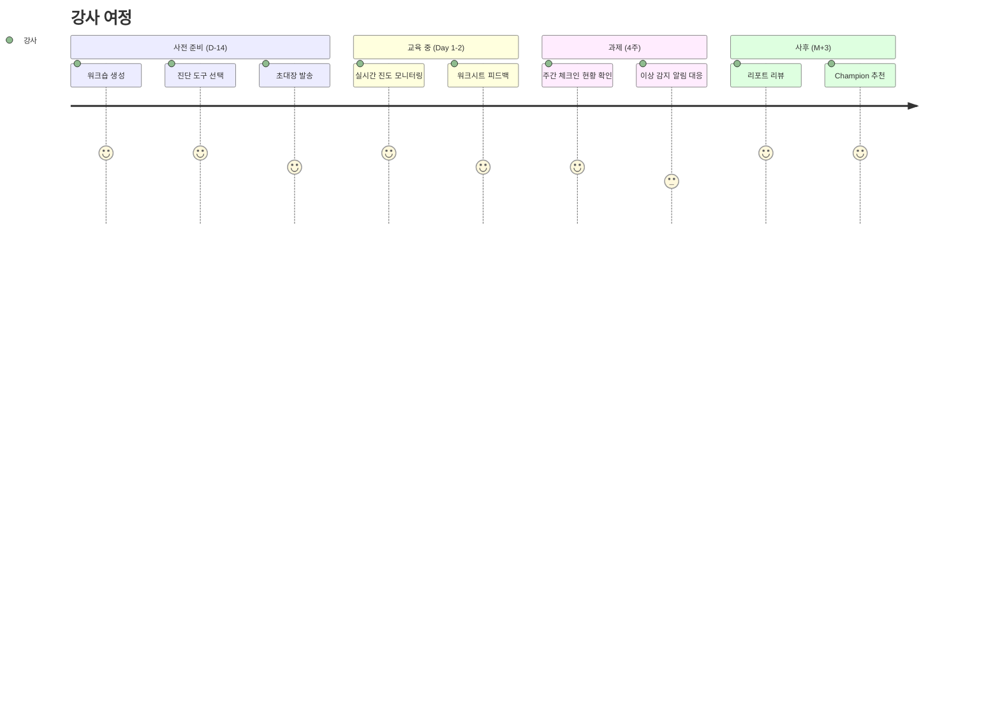
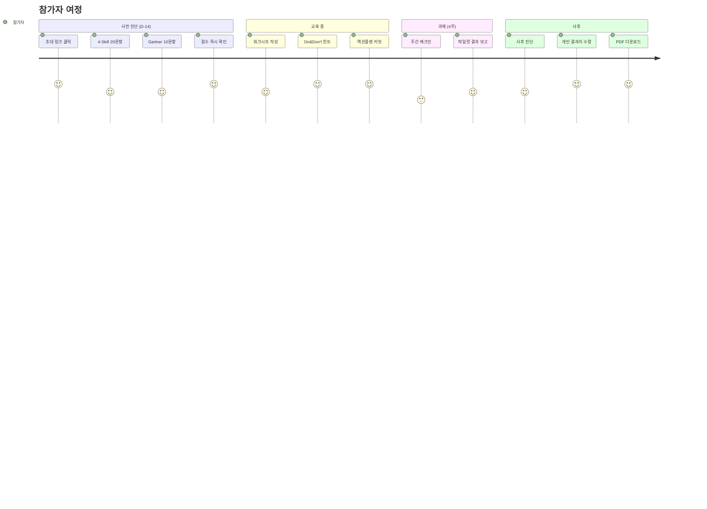

# FLOW~ AX Platform — PRD (Product Requirements Document)

> **FLOW~ : AX Design Lab** | 2026-04-19
> 기반: `01_Event_Storming.md` + `02_DDD_Domain_Model.md`
> 목적: 실제 구현 가능한 기능 명세·Firestore 스키마·API·UI 컴포넌트 정의

---

## 📌 1. 제품 개요

### 1.1 제품명
**FLOW~ AX Platform** — 진단·워크시트·리포팅 통합 앱

### 1.2 한 줄 정의
교육·컨설팅·강의 현장에서 **진단 → 워크시트 → 과제 → 리포트**까지 **한 번에 운영·측정·회수**하는 웹 플랫폼.

### 1.3 MVP 범위 (Phase A, 4주)
| 기능 | 포함 | 제외 |
|---|:---:|---|
| 4-Skill 20문항 진단 (사전/사후) | ✅ | — |
| Gartner 10문항 조직 진단 | ✅ | — |
| 워크시트 WS01/WS02/WS03 (RTC·ICEP·WHY-WHAT-HOW) | ✅ | WS04~09은 Phase B |
| 액션플랜 + 주간 체크인 | ✅ | — |
| 개인 결과지 (Before/After 레이더 + PGI) | ✅ | — |
| 조직 대시보드 (요약 KPI + 히트맵) | ✅ | — |
| Do & Don't 인라인 힌트 | ✅ | AI 코칭 (Phase B) |
| 360도 평가 | — | Phase B |
| PDF 내보내기 | ✅ | — |
| HRIS 연동 | — | Phase C |

### 1.4 타겟 사용자
- **Primary**: AX 리더십 교육 강사 (임정훈 등), HRD 담당자
- **Secondary**: 공공기관·대기업 교육 참가자 (차장·본부장급)
- **Tertiary**: HR·AX 부서 관리자 (조직 단위 분석)

---

## 🎯 2. 핵심 사용자 여정

### 2.1 Journey 1 — 강사 (Instructor)



### 2.2 Journey 2 — 참가자 (Participant)



---

## 🗂️ 3. 화면 구조 (Site Map)

```
/ (랜딩)
├─ /login (강사·관리자 로그인)
├─ /join/:code (참가자 워크숍 참여)
│
├─ /participant (참가자 대시보드)
│  ├─ /assessment/4skill (4-Skill 진단)
│  ├─ /assessment/gartner (Gartner 진단)
│  ├─ /assessment/icep (ICEP 매트릭스)
│  ├─ /worksheet/:template (WS01~WS09)
│  ├─ /actionplan (액션플랜 작성·커밋)
│  ├─ /checkin (주간 체크인)
│  ├─ /pilot-result (파일럿 결과 보고)
│  └─ /report (개인 결과지)
│
├─ /instructor (강사 대시보드)
│  ├─ /workshops (워크숍 목록·생성)
│  ├─ /workshops/:id (단일 워크숍 상세)
│  ├─ /workshops/:id/participants (참가자 현황)
│  ├─ /workshops/:id/responses (응답 취합)
│  ├─ /workshops/:id/anomalies (이상 감지)
│  └─ /workshops/:id/reports (리포트 생성)
│
├─ /admin (관리자 대시보드)
│  ├─ /org-dashboard (조직 요약)
│  ├─ /heatmap (본부별 Gartner 히트맵)
│  ├─ /champions (Champion 풀)
│  └─ /export (CSV·PDF 내보내기)
│
└─ /public/:reportId (공유 링크 — 읽기 전용)
```

---

## 🧩 4. Firestore 스키마 (기존 확장)

### 4.1 기존 구조 (유지)
```
workshops/{workshopId}
  ├─ teams/{teamId}
  │   └─ responses/{responseId}  -- 기존 AX Phase 응답
  └─ (기타 metadata)
```

### 4.2 신규 추가 구조
```
workshops/{workshopId}
  ├─ name, type, code, instructorId, status
  ├─ timeline { startDate, endDate, preAssessmentDue, postAssessmentDue }
  ├─ assessmentConfig { enabledAssessments[], questionVersion }
  │
  ├─ participants/{participantId}
  │   ├─ anonymousCode: "P01", "P02" ...
  │   ├─ displayName (optional, 익명 모드면 미사용)
  │   ├─ department, role, tier (T1/T2/T3)
  │   ├─ joinedAt
  │   └─ status: 'active' | 'withdrawn' | 'completed'
  │
  ├─ assessmentResponses/{responseId}
  │   ├─ participantId
  │   ├─ assessmentType: '4skill' | 'gartner' | 'icep' | '360-behavior'
  │   ├─ phase: 'pre' | 'mid' | 'post' | '360-supervisor' | ...
  │   ├─ answers: [ { questionId, value, answeredAt, timeSpentSec } ]
  │   ├─ scoreSummary: { byAxis: {A: x, B: y, ...}, total, level, percentile }
  │   ├─ anomalyFlags: [ { type, severity, detectedAt } ]
  │   ├─ submittedAt
  │   └─ responseDurationSec
  │
  ├─ worksheets/{worksheetId}
  │   ├─ participantId
  │   ├─ template: 'WS01' | ... | 'WS09'
  │   ├─ draft: { data, autoSavedAt, version }
  │   ├─ submission: { data, submittedAt, hash }
  │   └─ status: 'not_started' | 'in_progress' | 'submitted'
  │
  ├─ actionPlans/{actionPlanId}
  │   ├─ participantId
  │   ├─ tasks: [ { order, type, title, payload } ]
  │   ├─ committedAt
  │   ├─ status
  │   ├─ checkins/{weekNumber}
  │   │   └─ { success, failure, nextAction, submittedAt }
  │   └─ pilotResult: { baselineMetrics, afterMetrics, improvementRate, submittedAt }
  │
  ├─ reports/{reportId}
  │   ├─ type: 'individual' | 'org' | 'longitudinal'
  │   ├─ subjectId
  │   ├─ sections: [ { type, title, data, chartConfig } ]
  │   ├─ generatedAt
  │   └─ shareUrl
  │
  └─ trajectories/{trajectoryId}
      ├─ subjectId
      ├─ axis
      ├─ points: [ { timestamp, value, phase, source } ]
      └─ trend: 'improving' | 'stable' | 'declining'

hintRules/{ruleId}  -- 전역 컬렉션
  ├─ name, scope, condition (JSON DSL)
  ├─ do: { ko, en }
  ├─ dont: { ko, en }
  └─ priority
```

### 4.3 인덱스 (firestore.indexes.json 추가)
```json
{
  "indexes": [
    {
      "collectionGroup": "assessmentResponses",
      "fields": [
        {"fieldPath": "participantId", "order": "ASCENDING"},
        {"fieldPath": "phase", "order": "ASCENDING"},
        {"fieldPath": "submittedAt", "order": "DESCENDING"}
      ]
    },
    {
      "collectionGroup": "assessmentResponses",
      "fields": [
        {"fieldPath": "assessmentType", "order": "ASCENDING"},
        {"fieldPath": "phase", "order": "ASCENDING"}
      ]
    },
    {
      "collectionGroup": "trajectories",
      "fields": [
        {"fieldPath": "subjectId", "order": "ASCENDING"},
        {"fieldPath": "axis", "order": "ASCENDING"}
      ]
    }
  ]
}
```

### 4.4 보안 규칙 확장
```
rules_version = '2';
service cloud.firestore {
  match /databases/{database}/documents {

    // 전역 hintRules는 모두 읽기 가능, 쓰기는 관리자만
    match /hintRules/{ruleId} {
      allow read: if true;
      allow write: if request.auth != null && request.auth.token.admin == true;
    }

    match /workshops/{workshopId} {
      // 강사: 자기 워크숍 전체 read/write
      // 참가자: 해당 워크숍 읽기 가능
      allow read: if true;
      allow write: if request.auth != null;

      // 참가자 프로필
      match /participants/{participantId} {
        allow read, write: if true;  -- 익명 세션 허용, 클라이언트 검증
      }

      // 진단 응답: 본인만 쓰기, 강사·관리자 읽기 가능
      match /assessmentResponses/{responseId} {
        allow read: if true;
        allow create: if true;
        allow update: if resource.data.status == 'in_progress';  -- 제출 후 편집 금지
      }

      // 워크시트: Draft는 실시간 저장 허용, Submission은 생성만
      match /worksheets/{worksheetId} {
        allow read: if true;
        allow create, update: if true;
      }

      // 액션플랜·리포트·추이
      match /{document=**} {
        allow read, write: if true;
      }
    }
  }
}
```

> ⚠️ **MVP 보안 주의**: 현재 rules가 relaxed 상태. v2에서 Firebase Auth custom claims + 참가자 UID 기반 엄격 검증으로 강화.

---

## 🎨 5. 화면별 상세 명세

### 5.1 참가자 진단 화면 (`/participant/assessment/4skill`)

**레이아웃**
```
┌─────────────────────────────────────────┐
│ FLOW~ AX Platform    [진행 3/20]  [저장] │
├─────────────────────────────────────────┤
│                                         │
│ 🧠 AI Open Mindset 영역 (A축)            │
│                                         │
│ A3. 나는 월 1회 이상 새로운 AI 기능을      │
│     의도적으로 실험한다.                  │
│                                         │
│   ○ 1 전혀 아니다                        │
│   ● 2 아니다                            │
│   ○ 3 보통                              │
│   ○ 4 그렇다                            │
│   ○ 5 매우 그렇다                        │
│                                         │
│   💡 Do: "Claude Artifacts 같은 새 기능을  │
│           이번 주 1회 시도해보세요."       │
│                                         │
├─────────────────────────────────────────┤
│ [◀ 이전]                     [다음 ▶]    │
└─────────────────────────────────────────┘
```

**기능 요구사항**
- 문항 1개씩 노출 (모바일 최적화)
- 진행 막대 (3/20 형식)
- 자동 저장 10초 간격 (Firestore + localStorage 폴백)
- 응답 시간 < 30초 시 경고 토스트 "신중히 답변해주세요"
- 응답 기반 Do 힌트 실시간 표시
- 키보드 단축키: 1-5 숫자키, ← → 이전/다음
- 완료 시 즉시 점수 요약 화면으로 이동

### 5.2 개인 결과지 (`/participant/report`)

**섹션 구성**
1. **헤더 카드**: 이름(또는 익명 코드)·본부·진단일
2. **4-Skill 레이더 차트** (Chart.js radar):
   - 사전 (회색 영역) vs 사후 (FLOW~ 블루 영역) 중첩
   - 4축 라벨 + 사전/사후 수치 표기
3. **PGI 스코어 카드**: 큰 숫자 + 등급(우수/정상/보완/위험)
4. **수준 이동**: 축별 L1→L3 같은 변화 화살표
5. **강점 Top 3 / 보완 Top 3**: 자동 추출
6. **Do & Don't 요약**: 적용할 것 / 피할 것 카드형
7. **다음 단계 제안**: Champion 후보 안내 등
8. **공유 버튼**: "PDF 다운로드", "공유 링크 복사"

### 5.3 강사 대시보드 (`/instructor/workshops/:id`)

**레이아웃**
```
┌────────────────────────────────────────────────────┐
│ 🏁 코레일 AX 리더십 Q1 (코드: K7B3)   [참가자 24/25]   │
├──────────────┬────────────────┬────────────────────┤
│ L1 반응       │ L2 학습         │ L3 행동              │
│ 만족도 4.6    │ PGI +32%        │ 360도 +58%          │
│ NPS +72       │ Level +1.2      │ 행동 변화 진행       │
├──────────────┴────────────────┴────────────────────┤
│ 📊 실시간 진도 (워크시트 제출률)                      │
│  [WS01 ████████░░ 82%]  [WS02 ██████░░░░ 64%]      │
│  [WS03 ████░░░░░░ 45%]                              │
├────────────────────────────────────────────────────┤
│ ⚠️ 이상 감지 (3건)                                  │
│  • P07: 사전 진단 30초 미만 완료 (날림 의심)          │
│  • P12: 워크시트 WS02 2일간 미저장                  │
│  • P19: 주간 체크인 2주 연속 미제출                  │
├────────────────────────────────────────────────────┤
│ 🏆 Champion 후보 (2명)                              │
│  • P03 (본부: 수도권) — PGI 45%, 360도 4.3          │
│  • P11 (본부: 안전)   — PGI 42%, 360도 4.1          │
└────────────────────────────────────────────────────┘
```

**기능**
- 실시간 새로고침 (Firestore onSnapshot)
- 이상 감지 클릭 시 해당 참가자 상세 페이지로 이동
- "리포트 생성" 버튼 → 전체 참가자 일괄 생성

### 5.4 조직 대시보드 (`/admin/org-dashboard`)

**섹션**
1. **요약 KPI 카드 4개**: 참가 인원·완료율·평균 PGI·Champion 수
2. **본부별 Gartner 히트맵**: 5차원 × 본부 (D3.js 또는 Chart.js)
3. **월별 스몰윈 누적**: 라인차트
4. **EARS 5차원 레이더**
5. **Tier 1/2/3 비율 파이차트**

---

## ⚙️ 6. API 설계 (Vanilla JS 함수 시그니처)

### 6.1 Assessment API
```javascript
// 진단 시작
async function startAssessment({workshopId, participantId, assessmentType, phase})
  → returns { responseId, questions[] }

// 응답 저장 (자동 저장)
async function saveAssessmentAnswer({responseId, questionId, value, timeSpentSec})
  → returns { ok: boolean, hintsGenerated: Hint[] }

// 진단 제출 (최종)
async function submitAssessment({responseId})
  → returns { scoreSummary, anomalyFlags, reportPreview }
```

### 6.2 Worksheet API
```javascript
async function openWorksheet({workshopId, participantId, template})
  → returns { worksheetId, schema, existingDraft }

async function autoSaveDraft({worksheetId, data})
  → returns { version, savedAt }

async function submitWorksheet({worksheetId})
  → returns { submissionHash, submittedAt }
```

### 6.3 ActionPlan API
```javascript
async function commitActionPlan({participantId, tasks[]})
  → returns { actionPlanId, committedAt, nextCheckinDate }

async function submitWeeklyCheckin({actionPlanId, weekNumber, data})
  → returns { submittedAt, nextCheckin, reminderScheduled }

async function submitPilotResult({actionPlanId, baselineMetrics, afterMetrics, qualitativeReview})
  → returns { improvementRate, successCriteriaMet }
```

### 6.4 Reporting API
```javascript
async function generateIndividualReport({participantId})
  → returns { reportId, sections, shareUrl }

async function generateOrgReport({workshopId})
  → returns { reportId, kpis, heatmap, trajectories }

async function computeBeforeAfter({participantId, axis})
  → returns { pre, post, delta, pgi }

async function exportReportAsPDF({reportId})
  → returns { pdfBlob } -- html2pdf.js 클라이언트 생성
```

### 6.5 Guidance API
```javascript
async function evaluateHints({context: 'assessment'|'worksheet', data})
  → returns Hint[]

async function detectAnomalies({workshopId})
  → returns Anomaly[]
```

---

## 📐 7. 점수 산출 공식 (Domain Service)

### 7.1 4-Skill 점수
```
byAxis[A] = mean(answers for axis A)  -- 1.0 ~ 5.0
total = sum(byAxis) × 5               -- 20 ~ 100 (5점 척도 × 20문항)
level =
  L1 (5-10)    -- 미경험
  L2 (11-14)   -- 입문
  L3 (15-18)   -- 활용
  L4 (19-22)   -- 전문
  L5 (23-25)   -- 혁신
```

### 7.2 PGI (Personal Growth Index)
```
PGI = (postTotal - preTotal) / (100 - preTotal) × 100

등급:
  PGI ≥ 40% → 우수
  PGI 20-39% → 정상
  PGI 10-19% → 보완
  PGI < 10%  → 위험
```

### 7.3 360도 가중평균
```
weighted = (supervisorAvg × 0.30)
         + (peerAvg × 0.25)
         + (selfAvg × 0.20)
         + (subordinateAvg × 0.10)
         + (externalAvg × 0.15)
```

### 7.4 Champion 후보 판별
```
champion =
     pgi ≥ 40%
  && behavior360 ≥ 4.0
  && propagationCount ≥ 1  -- 액션플랜 #3 전파 결과
  && noCriticalAnomalies
```

---

## 🧪 8. Do & Don't 규칙 초기 세트 (JSON DSL)

```json
[
  {
    "id": "rule-a-low",
    "scope": "assessment_complete",
    "condition": {
      "type": "axisAverage",
      "assessmentType": "4skill",
      "axis": "A",
      "operator": "<=",
      "value": 2.5
    },
    "do": {
      "ko": "팀 미팅에서 AI 실패 경험 1개를 먼저 공유해보세요. 심리적 안전감이 학습의 출발점입니다."
    },
    "dont": {
      "ko": "모르는 것을 감추면 팀 전체가 공개 학습을 피합니다 (MIT SMR 2025 91% 문화 장벽)."
    },
    "priority": 10
  },
  {
    "id": "rule-b-low",
    "scope": "assessment_complete",
    "condition": {
      "type": "questionValue",
      "questionId": "4skill-B1",
      "operator": "<=",
      "value": 2.0
    },
    "do": {
      "ko": "다음 의사결정 전 Claude에게 (1)정보 탐색 → (2)시나리오 → (3)가정 도전 3단계로 질문해보세요."
    },
    "dont": {
      "ko": "1회성 검색으로 AI 답변을 쓰면 편향·환각 리스크가 누적됩니다."
    },
    "priority": 8
  },
  {
    "id": "rule-all-fives",
    "scope": "assessment_complete",
    "condition": {
      "type": "allAnswersEqual",
      "value": 5,
      "minQuestions": 5
    },
    "do": {
      "ko": "동료 피드백 3명을 받아 교차 검증해보세요 (360도 평가)."
    },
    "dont": {
      "ko": "자가진단 과신은 Upper Echelons Theory의 맹점을 강화합니다."
    },
    "priority": 9
  },
  {
    "id": "rule-checkin-missed",
    "scope": "checkin_missed",
    "condition": {
      "type": "consecutiveMisses",
      "weeks": 2
    },
    "do": {
      "ko": "15분 자가 체크인 루틴을 금요일 16:45에 달력 블록하세요."
    },
    "dont": {
      "ko": "'다음 주에 몰아서'는 행동 변화를 90% 무력화합니다 (Kirkpatrick L3)."
    },
    "priority": 7
  },
  {
    "id": "rule-speedrun",
    "scope": "anomaly",
    "condition": {
      "type": "responseDuration",
      "operator": "<",
      "value": 60,
      "unit": "seconds"
    },
    "do": {
      "ko": "진단은 15~20분이 적정입니다. 각 문항을 최근 3개월 경험에 비추어 답해주세요."
    },
    "dont": {
      "ko": "날림 응답은 PGI 지표 신뢰도를 무너뜨립니다."
    },
    "priority": 10
  }
]
```

---

## 🎯 9. MVP 기능 우선순위

### P0 (Must Have — MVP 런칭 필수)
1. 참가자 4-Skill 20문항 진단 (사전/사후)
2. Firestore 저장 + localStorage 폴백
3. 개인 결과지 (레이더 + PGI)
4. 강사 대시보드 (진도 모니터링)
5. Do & Don't 인라인 힌트 5종

### P1 (Should Have — MVP 직후)
6. Gartner 10문항 조직 진단
7. 워크시트 WS01 (RTC 캔버스)
8. 이상 감지 기본 2종 (속도·모두 같은 값)
9. PDF 내보내기

### P2 (Could Have — Phase B)
10. 워크시트 WS02 (ICEP), WS03 (WHY-WHAT-HOW)
11. 액션플랜 + 주간 체크인
12. 조직 대시보드 히트맵
13. 360도 평가

### P3 (Won't Have — Phase C 이후)
14. HRIS 연동
15. 카카오 알림톡
16. OpenAI 기반 AI 코칭

---

## 📊 10. 성공 지표 (제품 KPI)

| 지표 | MVP 1개월 | 3개월 |
|---|:---:|:---:|
| 활성 워크숍 | 1 | 5 |
| 완료된 진단 | 50 | 500 |
| 참가자 완주율 | 70% | 85% |
| 강사 NPS | 40+ | 60+ |
| 평균 응답 시간 | < 25분 | < 20분 |
| 이상 감지 정확도 | 80% | 92% |

---

## 🚢 11. 배포 계획

### 11.1 MVP 배포 타임라인 (2주)
- **D+0~3**: Firestore 스키마 확장 + 보안 규칙
- **D+4~7**: 4-Skill 진단 UI 구현 + 점수 계산
- **D+8~10**: 개인 결과지 (레이더 차트)
- **D+11~12**: 강사 대시보드 확장
- **D+13**: Do & Don't 힌트 엔진
- **D+14**: Vercel 배포 + 실전 파일럿 테스트

### 11.2 인프라
- **Repo**: GitHub `rescuemyself/flow-ax-workshop` (기존)
- **Prod**: Vercel auto-deploy from `master` branch
- **Staging**: Vercel preview deployments (PR 기준)
- **Firebase Project**: `flow-link-960e9` (기존 유지)

---

**FLOW~ : AX Design Lab | 사람과 일의 흐름을 디자인합니다**
