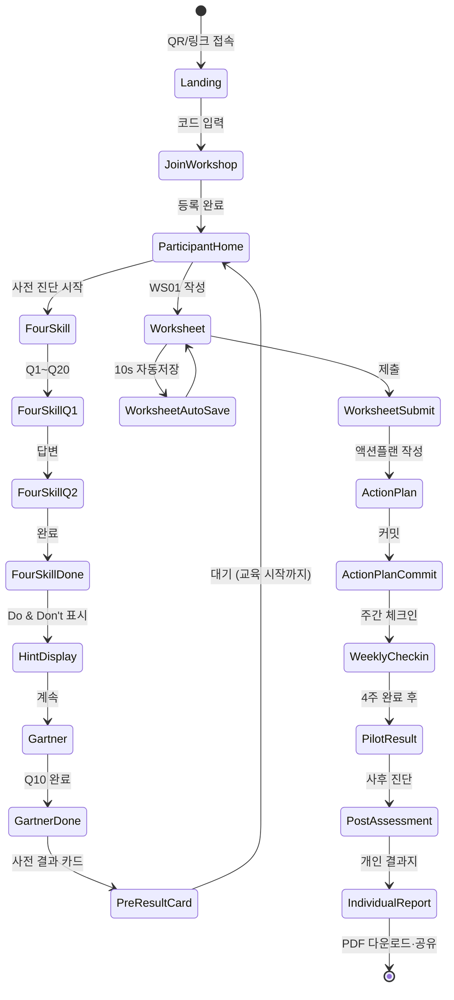
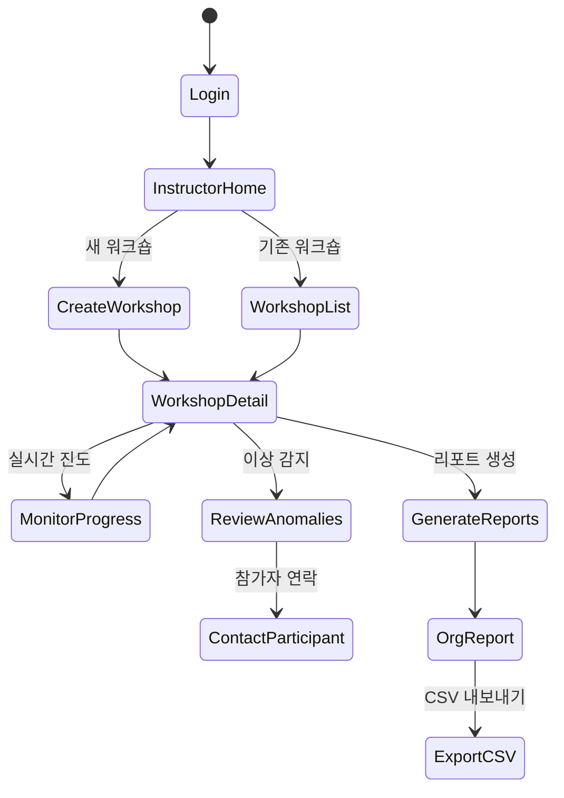
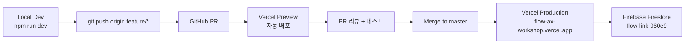

# FLOW~ AX Platform — UX Flow + Implementation Strategy

> **FLOW~ : AX Design Lab** | 2026-04-19
> 기반: `01_Event_Storming` · `02_DDD` · `03_PRD`

---

## 🗺️ Part A — UX Flow

### A.1 참가자 플로우 (State Diagram)



### A.2 강사 플로우



### A.3 핵심 화면 와이어프레임 (ASCII)

#### Landing (`/join/:code`)
```
┌────────────────────────────────────┐
│     FLOW~ AX Platform              │
│     사람과 일의 흐름을 디자인합니다    │
│                                    │
│     워크숍 코드를 입력하세요          │
│     ┌──────────┐                  │
│     │ K 7 B 3  │                  │
│     └──────────┘                  │
│                                    │
│          [ 입 장 ]                 │
│                                    │
└────────────────────────────────────┘
```

#### 진단 문항 화면 (mobile-first)
```
┌────────────────────────────────────┐
│ ◀ FLOW~ AX   3/20  ████░░░░  15%  │
├────────────────────────────────────┤
│                                    │
│   A축 · AI Open Mindset            │
│                                    │
│   Q3. 나는 월 1회 이상 새로운        │
│       AI 기능을 의도적으로 실험한다.  │
│                                    │
│   ┌──────────────────────────┐    │
│   │  1. 전혀 아니다            │    │
│   ├──────────────────────────┤    │
│   │  2. 아니다              ●  │    │
│   ├──────────────────────────┤    │
│   │  3. 보통                │    │
│   ├──────────────────────────┤    │
│   │  4. 그렇다              │    │
│   ├──────────────────────────┤    │
│   │  5. 매우 그렇다           │    │
│   └──────────────────────────┘    │
│                                    │
│   💡 Tip: 각 문항 최근 3개월         │
│       경험 기준으로 답해주세요        │
│                                    │
├────────────────────────────────────┤
│ [◀ 이전]              [다음 ▶]     │
└────────────────────────────────────┘
```

#### 개인 결과지
```
┌────────────────────────────────────────┐
│        📊 나의 AX 리더십 진단 결과        │
│                                        │
│    참가자: P03 · 수도권본부              │
│    사전: 2026-04-12 / 사후: 2026-07-20  │
├────────────────────────────────────────┤
│                                        │
│    [ 4-Skill 레이더 차트 ]              │
│                                        │
│         A (Open Mindset)               │
│              *       pre (회색)        │
│          *       *                     │
│      *     +            post (블루)    │
│   D ◀──────┼──────▶ B                  │
│      *     +       *                   │
│          *       *                     │
│              *                         │
│         C (Connector)                  │
│                                        │
├────────────────────────────────────────┤
│ PGI: +32%   ★ 우수 (상위 20% 기대)      │
│                                        │
│ Level: L2 입문 → L3 활용 ↑             │
│                                        │
│ 강점: A(+6), B(+7)                    │
│ 보완: C, D (L3 초기)                  │
├────────────────────────────────────────┤
│ 💡 다음 단계 추천:                     │
│  1. Champion 2주 집중 교육 신청        │
│  2. WS09 거버넌스 체크리스트 재검토     │
│                                        │
│ [ PDF 다운로드 ] [ 공유 링크 복사 ]     │
└────────────────────────────────────────┘
```

---

## 🏗️ Part B — Implementation Strategy

### B.1 기술 스택 (최종 확정)

| 계층 | 기술 | 이유 |
|---|---|---|
| **Frontend** | Vanilla HTML/CSS/JS | 기존 프로젝트 스택 유지, 러닝커브 최소 |
| **Charts** | Chart.js 4.x (CDN) | 레이더·라인·히트맵 모두 지원, 경량 |
| **PDF** | html2pdf.js (CDN) | 클라이언트 PDF 생성, 서버리스 |
| **Backend** | Firebase Firestore | 기존 `flow-link-960e9` 활용 |
| **Auth** | Firebase Auth (익명 + Google) | 강사 Google 로그인, 참가자 익명 |
| **Hosting** | Vercel (primary) + Firebase Hosting (fallback) | 기존 설정 활용 |
| **CI/CD** | GitHub → Vercel auto-deploy | master 푸시 시 자동 배포 |
| **언어 규칙** | ES6 modules, JSDoc 타입 힌트 | TypeScript 없이도 IDE 자동완성 |

### B.2 파일 구조 (기존 확장)

```
flow-ax-workshop/
├── index.html                  # 랜딩 (기존)
├── dashboard.html              # 참가자 (기존)
├── admin.html                  # 관리자 (기존)
│
├── assessment.html             # 🆕 진단 화면 (4-Skill + Gartner)
├── report.html                 # 🆕 개인 결과지
├── org-dashboard.html          # 🆕 조직 대시보드
│
├── js/
│   ├── firebase-config.js      # 기존 (공통 Firebase 유틸)
│   ├── ax-phases.js            # 기존 (AX 5 Phase)
│   ├── ax-admin.js             # 기존
│   │
│   ├── domain/                 # 🆕 DDD 도메인 레이어
│   │   ├── questions-4skill.js # 4-Skill 20문항 정의
│   │   ├── questions-gartner.js# Gartner 10문항 정의
│   │   ├── scoring.js          # 점수 계산 (PGI, 레벨, 360도)
│   │   ├── hint-rules.js       # Do & Don't 규칙 DSL
│   │   ├── hint-engine.js      # 규칙 평가 엔진
│   │   └── anomaly-detector.js # 이상 감지
│   │
│   ├── repositories/           # 🆕 데이터 접근 레이어
│   │   ├── assessment-repo.js
│   │   ├── worksheet-repo.js
│   │   └── report-repo.js
│   │
│   ├── app/                    # 🆕 Application 레이어
│   │   ├── assessment.js       # 진단 화면 컨트롤러
│   │   ├── report.js           # 결과지 컨트롤러
│   │   └── org-dashboard.js    # 조직 대시보드 컨트롤러
│   │
│   └── ui/                     # 🆕 UI 헬퍼
│       ├── radar-chart.js
│       ├── trajectory-chart.js
│       └── pdf-export.js
│
├── css/
│   ├── global.css              # 기존
│   ├── assessment.css          # 🆕
│   ├── report.css              # 🆕
│   └── ...
│
├── deliverables/app/           # 🆕 설계 문서 (본 문서 포함)
│   ├── 01_Event_Storming.md
│   ├── 02_DDD_Domain_Model.md
│   ├── 03_PRD.md
│   └── 04_UX_Flow_and_Implementation.md
│
├── firebase.json               # 기존
├── firestore.rules             # 기존 → 확장
├── firestore.indexes.json      # 기존 → 인덱스 추가
├── vercel.json                 # 기존 → 새 경로 추가
└── package.json                # 기존
```

### B.3 구현 순서 (14일 스프린트)

| Day | 작업 | 산출물 |
|:---:|---|---|
| 1 | Firestore 스키마·rules·indexes 확장 | `firestore.*` 수정 |
| 2 | 4-Skill 20문항 + Gartner 10문항 데이터 모듈 | `questions-*.js` |
| 3 | 점수 계산 로직 (축별·PGI·레벨) | `scoring.js` |
| 4 | Do & Don't 규칙 세트 + 엔진 | `hint-rules.js`, `hint-engine.js` |
| 5 | 이상 감지 로직 | `anomaly-detector.js` |
| 6-7 | 진단 UI (assessment.html + assessment.js) | 화면 구현 |
| 8 | Repository 계층 (Firestore 래핑) | `*-repo.js` |
| 9-10 | 개인 결과지 (report.html + 레이더 차트) | 결과지 구현 |
| 11 | 조직 대시보드 확장 (admin.html 기반) | admin 확장 |
| 12 | PDF 내보내기 (html2pdf.js) | 내보내기 기능 |
| 13 | 배포 + 보안 점검 + 실전 테스트 | Vercel 배포 |
| 14 | 실제 파일럿 운영 + 피드백 수집 | 운영 가동 |

### B.4 핵심 설계 원칙

**1. 기존 패턴 존중**
- 기존 `firebase-config.js`의 `workshops/teams/responses` 구조 확장
- localStorage 폴백 패턴 계승 (`flow-ax-*` prefix)
- Vanilla JS 유지 (TypeScript·React 재구성 안 함)

**2. 오프라인 우선 (Offline-First)**
- 모든 응답은 localStorage에 먼저 저장
- Firestore 동기화는 백그라운드
- Wi-Fi 끊긴 교육장에서도 작동

**3. 점진적 공개 (Progressive Disclosure)**
- Do & Don't 힌트는 **응답 기반**으로만 노출
- 이상 감지는 강사에게만 (참가자 혼란 방지)
- PGI 같은 민감 지표는 사후 진단 완료 시에만 표시

**4. 익명성 기본값**
- 참가자는 anonymousCode (P01, P02...) 사용
- displayName은 선택 항목
- 360도 평가자 응답은 집계 시에만 노출

**5. 불변 데이터**
- Submission은 immutable, 재제출은 새 Response
- 제출 후 편집 금지 (Firestore rules 검증)

### B.5 배포 파이프라인



**Vercel 자동 배포 설정**
- master 브랜치 push → production 배포
- PR → preview URL 자동 생성
- Vercel 환경 변수: Firebase config 하드코딩 (public key 허용됨)

**GitHub 워크플로우**
- 메인 브랜치: `master`
- 작업 브랜치: `feature/assessment-ui`, `feature/report-radar` 등
- 커밋 메시지 규칙: `feat:`, `fix:`, `refactor:`, `docs:`

### B.6 테스트 전략

**MVP 기간 — 수동 테스트 + 실전 운영**
- Playwright 자동화 테스트는 Phase B에서 도입
- MVP는 **실제 파일럿 1건**으로 End-to-End 검증

**테스트 시나리오 (수동)**
1. ✅ 참가자 코드 입장 → 사전 4-Skill 진단 완료 → 점수 확인
2. ✅ Gartner 10문항 완료 → 조직 레벨 확인
3. ✅ 워크시트 WS01 작성 → 자동 저장 → 제출
4. ✅ 네트워크 끊고 진단 → localStorage 저장 확인 → 재연결 동기화
5. ✅ 강사 대시보드 → 실시간 진도 확인
6. ✅ 리포트 생성 → 레이더 차트 → PDF 다운로드
7. ✅ 이상 감지 (날림 응답 30초 미만 테스트)

### B.7 위험·제약·완화

| 위험 | 영향 | 완화 |
|---|---|---|
| Firestore 할당량 초과 | 서비스 중단 | 1회 진단 = 20 write + 1 read, 월 500명 = 10,000 write로 여유 |
| Wi-Fi 불안정 | 응답 유실 | localStorage 폴백 (기존 패턴 계승) |
| 참가자 브라우저 호환성 | 일부 사용자 진입 불가 | 모바일 사파리·크롬 우선 테스트 |
| Firebase Auth 복잡도 | MVP 지연 | 초기 익명 인증만, SSO는 Phase B |
| PDF 생성 실패 | 참가자 결과지 수령 불가 | 실패 시 HTML 인쇄 버전 폴백 |
| 불공정한 점수 | 참가자 불만 | AnomalyFlag 강사 리뷰 + 공정성 위원회 |

### B.8 Do & Don't (앱 개발 자체에 대한)

**Do ✅**
- 기존 `firebase-config.js` 패턴을 계승해서 점진 확장
- 모든 비동기 저장은 try/catch + localStorage 폴백
- DDD Aggregate 경계 명확히 (Response는 Worksheet와 섞지 않음)
- Chart.js 렌더는 Web Component 형태로 재사용성 확보
- JSDoc 타입 힌트로 IDE 자동완성 활용
- 모든 수치는 "Before/After" 패턴으로 표시

**Don't ❌**
- 기존 Vanilla JS를 React/Next.js로 재구성 (러닝커브·리팩토링 부담)
- Firebase Admin SDK를 클라이언트에서 사용 (보안)
- Do & Don't 힌트를 강제 노출 (학습 피로 누적)
- PGI·360도 같은 민감 지표를 권한 없이 노출
- 제출 후 Response를 편집 허용
- 진단 문항을 한 번에 20개 표시 (모바일 가독성 파괴)

---

## 🎯 Part C — 다음 단계 (즉시 실행)

### 구현 순서
1. **Firestore rules + indexes** 확장 — 단일 커밋
2. **`questions-4skill.js`** — 20문항 데이터 (2시간)
3. **`scoring.js`** — 점수 계산 (1시간)
4. **`hint-rules.js` + `hint-engine.js`** — 규칙 엔진 (2시간)
5. **`assessment.html` + `assessment.js`** — 진단 UI (4시간)
6. **`report.html` + `report.js`** — 결과지 (3시간)
7. **Vercel 배포** — 30분
8. **파일럿 테스트** — 실제 사용자 1-3명

---

**FLOW~ : AX Design Lab | 사람과 일의 흐름을 디자인합니다**
flowdesign.ai.kr | rescuemyself@gmail.com | 010-5261-9459
